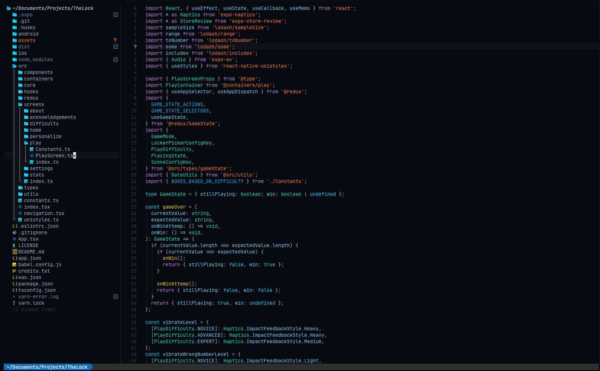

# nvim-vscode-setup-jt — Neovim with VSCode Keybindings

<p align="center">
  
</p>

<p align="center">
  A ready-to-go Neovim + LazyVim configuration with VSCode-style shortcuts, a custom dark theme, and a one-command macOS installer.
</p>

<p align="center">
  <strong>Built on</strong> <a href="https://www.lazyvim.org/">LazyVim</a> &nbsp;|&nbsp;
  <strong>Theme:</strong> JARVIS (custom dark cyan palette) &nbsp;|&nbsp;
  <strong>Platform:</strong> macOS
</p>

---

## Quick Install

```bash
curl -fsSL https://raw.githubusercontent.com/jtvargas/nvim-vscode-setup-jt/main/install.sh | bash
```

> Already have a Neovim config? The script backs it up automatically to `~/.config/nvim.bak.<timestamp>`. Nothing is deleted.

---

## Table of Contents

- [What Gets Installed](#what-gets-installed)
- [Manual Install](#manual-install)
- [After Installation](#after-installation)
- [iTerm2 — Use Cmd Instead of Ctrl](#iterm2--use-cmd-instead-of-ctrl)
- [Keymaps Reference](#keymaps-reference)
- [Plugins](#plugins)
- [Configuration](#configuration)
- [Extending](#extending)
- [Useful Commands](#useful-commands)
- [Uninstall](#uninstall)

---

## What Gets Installed

The install script sets up everything needed, skipping anything already present:

| Tool | Purpose | Install method |
|------|---------|----------------|
| [Homebrew](https://brew.sh) | macOS package manager | Official installer |
| [Neovim](https://neovim.io) | The editor | `brew install neovim` |
| [ripgrep](https://github.com/BurntSushi/ripgrep) | Fast text search (grep picker) | `brew install ripgrep` |
| [fd](https://github.com/sharkdp/fd) | Fast file finder (file picker) | `brew install fd` |
| [lazygit](https://github.com/jesseduffield/lazygit) | Terminal Git UI (`Space+gg`) | `brew install lazygit` |
| [JetBrains Mono Nerd Font](https://www.nerdfonts.com) | Font with icons for the UI | `brew install --cask font-jetbrains-mono-nerd-font` |

---

## Manual Install

If you prefer not to pipe to bash:

```bash
# 1. Install dependencies
brew install neovim ripgrep fd lazygit
brew install --cask font-jetbrains-mono-nerd-font

# 2. Back up existing config (if any)
[ -d ~/.config/nvim ] && mv ~/.config/nvim ~/.config/nvim.bak

# 3. Clean Lazy.nvim cache
rm -rf ~/.local/share/nvim ~/.local/state/nvim ~/.cache/nvim

# 4. Clone and copy config
git clone https://github.com/jtvargas/nvim-vscode-setup-jt.git /tmp/nvim-setup
cp -r /tmp/nvim-setup/nvim ~/.config/nvim
rm -rf /tmp/nvim-setup

# 5. Set your terminal font to "JetBrains Mono Nerd Font"

# 6. Launch Neovim — plugins install automatically on first run
nvim
```

---

## After Installation

1. **Set your terminal font** to `JetBrains Mono Nerd Font` (required for icons)
   - **iTerm2:** Preferences > Profiles > Text > Font
   - **Terminal.app:** Preferences > Profiles > Font > Change
   - **Kitty / WezTerm / Alacritty:** Update your config file

2. **Launch Neovim** — Lazy.nvim auto-installs all plugins on first launch

3. **Restart Neovim** after plugins finish installing

4. **Press `Space`** to see the which-key menu with all available shortcuts

---

## iTerm2 — Use Cmd Instead of Ctrl

By default, terminal apps intercept `Cmd` keypresses (e.g., `Cmd+W` closes the terminal tab, not the Neovim buffer). The keymaps use `Ctrl` as a universal workaround.

**But if you use iTerm2**, you can remap `Cmd` to send `Ctrl` to Neovim — so you press `Cmd+S` and Neovim receives `Ctrl+S`. Best of both worlds.

**One-liner setup** (close iTerm2 first!):

```bash
curl -fsSL https://raw.githubusercontent.com/jtvargas/nvim-vscode-setup-jt/main/setup-iterm-keys.sh | bash
```

This adds global key mappings for:

| You press | Neovim receives | Action |
|-----------|-----------------|--------|
| `Cmd+S` | `Ctrl+S` | Save file |
| `Cmd+Z` | `Ctrl+Z` | Undo |
| `Cmd+Y` | `Ctrl+Y` | Redo |
| `Cmd+A` | `Ctrl+A` | Select all |
| `Cmd+P` | `Ctrl+P` | Find files |
| `Cmd+F` | `Ctrl+F` | Search in file |
| `Cmd+G` | `Ctrl+G` | Grep all files |
| `Cmd+W` | `Ctrl+W` | Close buffer |
| `Cmd+D` | `Ctrl+D` | Multi-select next |
| `Cmd+B` | `Ctrl+B` | Toggle explorer |
| `Cmd+\` | `Ctrl+\` | Vertical split |

<details>
<summary><strong>Manual setup</strong> (click to expand)</summary>

If you prefer to add mappings by hand:

1. Open iTerm2 > **Settings > Keys > Key Bindings**
2. Click **+** to add a new mapping
3. Set **Shortcut** to the Cmd combo (e.g., `Cmd+S`)
4. Set **Action** to **Send Hex Code**
5. Enter the hex code from the table below and click OK

| Shortcut | Hex Code |
|----------|----------|
| `Cmd+S` | `0x13` |
| `Cmd+Z` | `0x1a` |
| `Cmd+Y` | `0x19` |
| `Cmd+A` | `0x01` |
| `Cmd+P` | `0x10` |
| `Cmd+F` | `0x06` |
| `Cmd+G` | `0x07` |
| `Cmd+W` | `0x17` |
| `Cmd+D` | `0x04` |
| `Cmd+B` | `0x02` |
| `Cmd+\` | `0x1c` |

</details>

---

## Keymaps Reference

All custom keymaps use **Ctrl** in place of macOS **Cmd** for terminal compatibility.
If you're on iTerm2, [set up Cmd remapping](#iterm2--use-cmd-instead-of-ctrl) to use Cmd directly.
Defined in [`lua/config/keymaps.lua`](nvim/lua/config/keymaps.lua).

### Custom Shortcuts (VSCode-Style)

**General**

| Shortcut | Mode | Action | Notes |
|----------|------|--------|-------|
| `Ctrl+S` | n, i, v | Save file | `:w` |
| `Ctrl+Z` | n | Undo | `u` |
| `Ctrl+Y` | n | Redo | `Ctrl+R` |
| `Ctrl+A` | n | Select all | `ggVG` |

**Navigation & Search**

| Shortcut | Mode | Action | Notes |
|----------|------|--------|-------|
| `Ctrl+P` | n | Find files (frecency sort) | `Snacks.picker.smart()` |
| `Tab` | n | Switch buffer | `Snacks.picker.buffers()` |
| `Ctrl+G` | n | Grep across all files | `Snacks.picker.grep()` |
| `Ctrl+F` | n | Search in current file | `Snacks.picker.lines()` |
| `Ctrl+B` | n | Toggle file explorer | Neo-tree |
| `Ctrl+W` | n | Close current buffer | `Snacks.bufdelete()` |

**Editing**

| Shortcut | Mode | Action | Notes |
|----------|------|--------|-------|
| `Ctrl+Click` | n | Go to definition / open file | Smart: path → file, symbol → LSP |
| `Double-click` | n | Select word | `viw` |
| `Ctrl+D` | n, v | Multi-select next occurrence | vim-visual-multi |
| `Ctrl+Shift+Down` | n, v | Duplicate line/selection down | |
| `Ctrl+Shift+Up` | n, v | Duplicate line/selection up | |
| `Ctrl+/` | n, v | Toggle comment | |

**Splits, Terminal & Git**

| Shortcut | Mode | Action |
|----------|------|--------|
| `Ctrl+\` | n | Vertical split |
| `Ctrl+H/J/K/L` | n | Navigate between splits |
| `` Ctrl+` `` | n | Toggle terminal |
| `Space g b` | n | Toggle inline git blame |

<details>
<summary><strong>LazyVim Built-in Keymaps</strong> (click to expand)</summary>

These are available without any configuration. Full list: https://www.lazyvim.org/keymaps

**Leader Key = `Space`**

| Shortcut | Action |
|----------|--------|
| `Space` | Show which-key menu |
| `Space f f` | Find files |
| `Space f g` | Live grep |
| `Space f r` | Recent files |
| `Space b b` | Switch buffer |
| `Space b d` | Delete buffer |
| `Space e` | File explorer |
| `Space l` | Lazy plugin manager |
| `Space c a` | Code action (LSP) |
| `Space c r` | Rename symbol (LSP) |
| `Space c f` | Format document |
| `Space x x` | Trouble diagnostics |
| `Space g g` | Lazygit |
| `Space g s` | Git status |
| `Space s g` | Grep in project |
| `Space q q` | Quit all |
| `Space q s` | Restore session |
| `Space u c` | Toggle colorscheme |
| `Space u n` | Toggle line numbers |
| `Space u w` | Toggle word wrap |

**Navigation (No Leader)**

| Shortcut | Action |
|----------|--------|
| `s` | Flash jump (search + jump) |
| `S` | Flash treesitter select |
| `H` / `L` | Previous / Next buffer |
| `]d` / `[d` | Next / Previous diagnostic |
| `gd` | Go to definition |
| `gr` | Go to references |
| `K` | Hover documentation |
| `gcc` | Toggle line comment |
| `gc` (visual) | Toggle selection comment |

</details>

---

## Plugins

36 plugins total. Plugins marked **[custom]** have user-defined configurations.

**Editor**

| Plugin | Purpose |
|--------|---------|
| `neo-tree.nvim` **[custom]** | File explorer (shows hidden files) |
| `vim-visual-multi` **[custom]** | Multi-cursor editing (Ctrl+D) |
| `flash.nvim` | Enhanced search / jump |
| `grug-far.nvim` | Find and replace across files |
| `mini.ai` | Extended text objects |
| `mini.pairs` | Auto-close brackets/quotes |
| `todo-comments.nvim` | Highlight TODO/FIX/NOTE |
| `trouble.nvim` | Diagnostics viewer |
| `which-key.nvim` | Keybinding cheatsheet |
| `persistence.nvim` | Session persistence |

**UI & Theme**

| Plugin | Purpose |
|--------|---------|
| `vscode.nvim` **[custom]** | JARVIS dark theme |
| `bufferline.nvim` | Buffer tab bar |
| `lualine.nvim` | Status line |
| `noice.nvim` | Enhanced messages & cmdline |
| `nvim-web-devicons` / `mini.icons` | File icons |

**Code Intelligence**

| Plugin | Purpose |
|--------|---------|
| `nvim-lspconfig` + `mason.nvim` | LSP servers (auto-install via `:Mason`) |
| `nvim-treesitter` | Syntax parsing & highlighting |
| `nvim-ts-autotag` | Auto-close HTML/JSX tags |
| `conform.nvim` | Code formatter |
| `nvim-lint` | Linter integration |
| `blink.cmp` + `friendly-snippets` | Completion & snippets |

**Git**

| Plugin | Purpose |
|--------|---------|
| `gitsigns.nvim` **[custom]** | Git signs + inline blame (GitLens-style) |

---

## Configuration

**Config root:** `~/.config/nvim/`

```
~/.config/nvim/
├── init.lua                        # Entry point
├── lazyvim.json                    # LazyVim extras (none enabled)
├── stylua.toml                     # Lua formatter settings
├── .neoconf.json                   # Lua LS + neodev config
└── lua/
    ├── config/
    │   ├── keymaps.lua             # ★ VSCode-style keybindings
    │   ├── options.lua             # ★ Vim options
    │   ├── lazy.lua                # Plugin manager setup
    │   └── autocmds.lua            # ★ JS/TS file path resolution
    └── plugins/
        ├── colorscheme.lua         # ★ JARVIS dark theme
        ├── neo-tree.lua            # ★ File explorer config
        ├── vim-visual-multi.lua    # ★ Multi-cursor config
        └── gitsigns.lua           # ★ Inline git blame (GitLens)
```

### Quick Reference: What to Edit

| I want to... | Edit this file |
|---|---|
| Add/change a shortcut | `lua/config/keymaps.lua` |
| Change a Vim option | `lua/config/options.lua` |
| Add an autocommand | `lua/config/autocmds.lua` |
| Add a new plugin | Create a file in `lua/plugins/` |
| Change the theme | `lua/plugins/colorscheme.lua` |
| Configure file explorer | `lua/plugins/neo-tree.lua` |
| Enable a LazyVim extra | `:LazyExtras` in Neovim |

### Custom Options

| Option | Value | Effect |
|--------|-------|--------|
| `mouse` | `"a"` | Mouse enabled in all modes |
| `clipboard` | `"unnamedplus"` | Yank/paste uses system clipboard |

### Neo-tree

| Setting | Value | Effect |
|---------|-------|--------|
| `follow_current_file` | `true` | Tree follows the active file |
| `hide_dotfiles` | `false` | Shows `.env`, `.git`, etc. |
| `hide_gitignored` | `false` | Shows gitignored files |
| Right-click | — | Context menu (Delete, Rename, Copy, Cut, Paste, New) |

### Inline Git Blame (GitLens-style)

Defined in [`lua/plugins/gitsigns.lua`](nvim/lua/plugins/gitsigns.lua). Shows author, time, and commit message on the current line — like VSCode's GitLens extension.

| Setting | Value | Effect |
|---------|-------|--------|
| `current_line_blame` | `true` | Enabled by default |
| `virt_text_pos` | `"eol"` | Shows at end of line |
| `delay` | `300` | 300ms debounce (fast, no lag) |
| Format | `<author> [<time>] - <summary>` | e.g., "John [2 hours ago] - Fix bug" |

Toggle with `Space g b`. The text is automatically dimmed (low opacity) and hides in insert mode.

<details>
<summary><strong>JARVIS Color Palette</strong> (click to expand)</summary>

Defined in [`lua/plugins/colorscheme.lua`](nvim/lua/plugins/colorscheme.lua). Based on `Mofiqul/vscode.nvim`.

**Settings:** Transparent background, italic comments, underlined links.

| Token | Hex | Usage |
|-------|-----|-------|
| `vscBack` | `#0A0E14` | Main background |
| `vscFront` | `#B0C4DE` | Default text |
| `vscBlue` | `#00D9FF` | Primary accent (cyan) |
| `vscAccentBlue` | `#00BFFF` | Secondary accent |
| `vscLightBlue` | `#7FDBFF` | Light highlights |
| `vscBlueGreen` | `#00E5CC` | Blue-green accent |
| `vscGreen` | `#3D9970` | Strings, success |
| `vscYellow` | `#FFD700` | Warnings, constants |
| `vscYellowOrange` | `#F5A623` | Parameters |
| `vscOrange` | `#FF8C42` | Types |
| `vscPink` | `#C792EA` | Keywords (purple) |
| `vscRed` | `#FF5555` | Errors, deletions |
| `vscLineNumber` | `#2A4A5A` | Line numbers |
| `vscSelection` | `#0D3A58` | Selection highlight |
| `vscCursorDarkDark` | `#0D1117` | Cursor line bg |
| `vscSearch` | `#1A4A3A` | Search match bg |
| `vscPopupBack` | `#0D1117` | Popup background |
| `vscSplitDark` | `#1A3A4A` | Window split divider |

**Highlight Overrides:** `CursorLine` bg = `#0D1117`, `CursorLineNr` fg = `#00D9FF` (bold).

</details>

<details>
<summary><strong>LazyVim Default Options</strong> (click to expand)</summary>

These are inherited from LazyVim and apply automatically:

| Option | Value | Effect |
|--------|-------|--------|
| `number` | `true` | Line numbers |
| `relativenumber` | `true` | Relative line numbers |
| `expandtab` | `true` | Spaces instead of tabs |
| `tabstop` | `2` | Tab = 2 spaces |
| `shiftwidth` | `2` | Indent = 2 spaces |
| `smartindent` | `true` | Auto-indent new lines |
| `wrap` | `false` | No line wrapping |
| `ignorecase` | `true` | Case-insensitive search |
| `smartcase` | `true` | ...unless uppercase is used |
| `termguicolors` | `true` | True color support |
| `signcolumn` | `"yes"` | Always show sign column |
| `cursorline` | `true` | Highlight current line |

Full defaults: https://github.com/LazyVim/LazyVim/blob/main/lua/lazyvim/config/options.lua

</details>

---

## Extending

### Add a Plugin

Create a new `.lua` file in `lua/plugins/`:

```lua
-- lua/plugins/my-plugin.lua
return {
  {
    "author/plugin-name",
    opts = {
      -- plugin options here
    },
  },
}
```

### Add a Keymap

Add to `lua/config/keymaps.lua`:

```lua
vim.keymap.set("n", "<leader>xx", "<cmd>SomeCommand<cr>", { desc = "Description" })
```

### Enable a LazyVim Extra

Run `:LazyExtras` in Neovim, browse available extras, and press `x` to toggle.

Popular extras: `lang.typescript`, `lang.python`, `lang.rust`, `lang.go`, `lang.json`, `lang.docker`, `editor.mini-files`, `ui.mini-animate`

### Install an LSP Server

Open Neovim, run `:Mason`, search for a server, press `i` to install.

Or add programmatically:

```lua
-- lua/plugins/lsp.lua
return {
  {
    "neovim/nvim-lspconfig",
    opts = {
      servers = {
        pyright = {},
        tsserver = {},
      },
    },
  },
}
```

---

## Useful Commands

| Command | What it does |
|---------|--------------|
| `:Lazy` | Open plugin manager |
| `:LazyExtras` | Browse/enable extras |
| `:Mason` | Open LSP/tool installer |
| `:Neotree` | Open file explorer |
| `:checkhealth` | Diagnose Neovim health |
| `:LspInfo` | Show active LSP servers |
| `:ConformInfo` | Show active formatters |

---

## Uninstall

```bash
# Remove config
rm -rf ~/.config/nvim

# Remove plugin data and cache
rm -rf ~/.local/share/nvim ~/.local/state/nvim ~/.cache/nvim

# Restore previous config (if backed up)
# mv ~/.config/nvim.bak ~/.config/nvim
```
